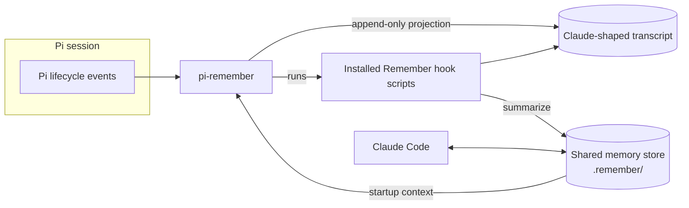

# pi-remember

Give [Pi](https://github.com/earendil-works/pi) the same long-term memory as Claude Code.

`pi-remember` is a Pi extension that connects Pi sessions to the **Claude Code Remember plugin** you already have installed. Pi and Claude Code then read and write **one shared memory store**. Work you do in either tool is summarized automatically, and that memory is loaded into the next session, whichever tool you open.

The extension contains none of Remember's code. It finds the copy Claude Code installed and runs that.

> [!WARNING]
> **Pre-release: capture is currently off.** Memory hooks only run after a provider-free compatibility check (see [Qualification](#qualification)) passes every required scenario. Two scenarios are still marked `blocked`, so for now the extension runs **read-only**. Diagnostics and status work; automatic capture does not yet.

## Contents

- [How it works](#how-it-works)
- [Requirements](#requirements)
- [Install](#install)
- [Commands](#commands)
- [Qualification](#qualification)
- [Configuration](#configuration)
- [Provider and billing](#provider-and-billing)
- [Privacy and security](#privacy-and-security)
- [Troubleshooting](#troubleshooting)
- [Limitations](#limitations)
- [Development](#development)
- [License](#license)

## How it works



1. **Projection.** Each Pi session branch is copied into an append-only, Claude-shaped transcript. Lines already written are never rewritten, so resume, fork, `/tree` navigation, compaction and reload all stay consistent.
2. **Hooks.** Pi events are mapped to Remember's own hook scripts:

   | Pi event | Remember hook | Purpose |
   |---|---|---|
   | `session_start` | `session-start-hook.sh` | Load memory into the session |
   | `before_agent_start` | `user-prompt-hook.sh` | Add per-prompt context |
   | `turn_end`, `agent_end`, `agent_settled`, `session_tree` | `post-tool-hook.sh` | Automatic save check |
   | `session_compact` | `session-start-hook.sh` (source `compact`) | Reload memory after compaction |
   | `session_shutdown` | `session-end-hook.sh` | Final forced save |

3. **Remember decides what to keep.** Saves are rate-limited: at most once every 120 seconds, and only after at least 3 of your messages (or 30 back-and-forth exchanges without you). The summarizer replies `SKIP` for small talk or for work already recorded, so only real progress is stored. Entries are rolled up hourly into daily, 7-day and archive files.
4. **Recall.** Recent memory is added to the model's context once per session, as a hidden message the model sees but you don't. Human-facing notices from Remember stay in the UI and never reach the model.

Tool calls never wait on any of this: hooks run on a serialized background queue. On shutdown, a bounded handoff leaves a recovery marker, which the next session replays if the final save didn't finish.

## Requirements

| Component | Version |
|---|---|
| Claude Code Remember plugin | exactly `0.30.0` (commit `54f4da9f10a90b77fb57318192bd5a936a6d4a01`) |
| Pi (`@earendil-works/pi-coding-agent`) | lifecycle written against `0.85.1`; smoke-tested on `0.87.1` |
| Tools on `PATH` | `bash`, `python3`, `jq` |
| OS | Linux / POSIX. Windows is untested. |

Install Remember in Claude Code first (`/plugin install remember@claude-plugins-official`). Any version other than the pinned one keeps this extension read-only.

## Install

From GitHub:

```bash
pi install git:github.com/Rishang/pi-remember
```

From a local clone:

```bash
git clone https://github.com/Rishang/pi-remember.git
pi install ./pi-remember            # personal: ~/.pi/agent/settings.json
pi install ./pi-remember -l         # this project only: .pi/settings.json (needs project trust)
```

Try it for a single run without installing:

```bash
pi -e ./pi-remember
```

Then check it loaded:

```text
/remember-status
```

## Commands

| Command | What it does |
|---|---|
| `/remember-status` | Adapter state: supported vs installed Remember version, probe issues, session and projection state, queue, and last hook result. |
| `/remember:doctor` | Runs Remember's own `doctor.sh` and shows its report unchanged: paths, tools, storage mode, capture health. Works in read-only mode, so it can explain why. |
| `/remember-save` | Waits until the agent is idle, then forces an immediate save of this session. Reports the actual result. |
| `/skill:remember` | Remember's handoff skill, loaded from the installed plugin. Writes a short "where I stopped / what's next" note. Only offered when the installed version passes the pin. |

Command output goes to the UI notification area, or to stderr when there is no UI. It is never posted as a chat message, because Pi sends those to the model. Stdout stays clean in print and JSON modes.

## Qualification

Hooks stay disabled until the installed runtime passes a black-box compatibility check:

```bash
npm run test:parity -- --output-root ~/.pi/agent/remember
```

The harness runs the installed Remember runtime in isolated temporary home directories with a fake provider on `PATH`, so it **never makes model calls or touches your real memory store**. It writes `qualification-v1.json`. Hooks run only when that report matches the installed version and commit and every required scenario has `passed`.

## Configuration

| Setting | Effect |
|---|---|
| `PI_REMEMBER_PLUGIN_ROOT` | Use this Remember install directory instead of the one recorded in `~/.claude/plugins/installed_plugins.json`. It must still pass every check. |
| Remember's own config | `~/.remember/config.json` and `<project>/.remember/config.json` work exactly as they do in Claude Code. The adapter adds no config layer of its own. |

Adapter state (projections, recovery markers, qualification report) lives in `~/.pi/agent/remember`.

## Provider and billing

Remember chooses the summarizer, not this extension. For these transcripts it calls the `claude` CLI (Haiku), billed to whatever account that CLI is logged into. `pi-remember` adds no provider, never switches provider, and makes no network requests of its own.

## Privacy and security

- **Session text on disk.** Projections contain session text. They are written as owner-only files (`0700` directories, `0600` files). Nothing at all is written in read-only mode.
- **Minimal environment.** Remember scripts run with an allowlisted environment (`PATH`, `HOME`, `USER`, locale, `TZ`, and Remember's path variables). Other variables are not passed through, and secrets are redacted from captured output.
- **Path checks.** The plugin root, projection and recovery paths are resolved to real paths and must stay inside their expected directories. Symlink escapes are rejected.
- **Git backup stays off.** Remember's optional git backup sends memory off-machine. It stays under Remember's own config and is never enabled by this extension.
- **Project trust.** A project-local install (`-l`) only loads after you trust the project in Pi.

## Troubleshooting

| Symptom | Check |
|---|---|
| `/remember-status` shows `unsupported-version` | Your installed Remember isn't `0.30.0`. The extension stays read-only by design. |
| `installed-record-unreadable` / `installed-record-missing` | Remember isn't installed in Claude Code, or `~/.claude/plugins/installed_plugins.json` is missing. |
| `required-tool-missing` | Install `bash`, `python3` or `jq` and make sure they're on `PATH`. |
| `behavior-unverified` / `behavior-incomplete` | Run [qualification](#qualification). |
| Is Remember itself healthy? | Run `/remember:doctor`. Its verdict comes straight from Remember. |

## Limitations

- **Read-only for now.** Capture stays off until qualification passes (see the warning at the top).
- **Recent memory, not search.** Recall is compressed recent memory loaded at startup, not a search over past sessions on every prompt.
- **Some details aren't in status.** Remember decides the store path and summarizer, so `/remember-status` doesn't show them; use `/remember:doctor`.
- **No `/remember` command.** Pi runs skills as `/skill:remember`, and a separate command could shadow Remember's own skill.
- **No pruning yet.** Projection files are not pruned yet.

## Development

```bash
npm run check        # syntax-check every module
npm test             # unit, integration, and provider-free parity tests
npm run test:parity  # print a qualification report for the installed runtime
```

The design, lifecycle mapping and release criteria are documented in [ARCHITECTURE.md](ARCHITECTURE.md).

## License

Not yet licensed for distribution. Remember's Community License is unclear about modification and redistribution, so the package stays `private` until that is clarified. This repository contains none of Remember's scripts, prompts or docs.
